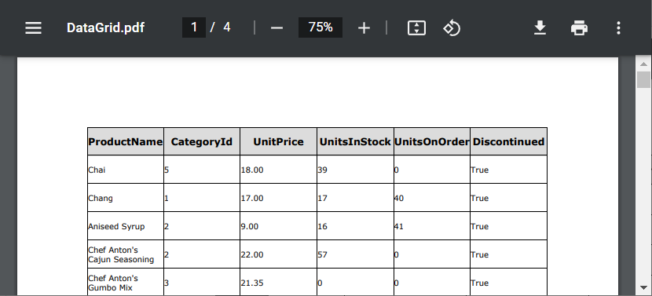

<!-- default badges list -->

<!-- default badges end -->

# Grid for Blazor - How to use DevExpress Reporting tools to implement export in a WebAssembly application

The [Grid](https://docs.devexpress.com/Blazor/403143/grid) component allows you to [export data](https://demos.devexpress.com/blazor/Grid/Export/DataAwareExport) in XLS, XLSX, and CSV formats. You can also use DevExpress Reporting tools to implement export to different formats (PDF, XLSX, and DOCX). This example illustrates how to accomplish this task in a Blazor WebAssembly application.

## Quick Start

The export application should connect to the same port that the Web API application uses. Start the Web API application, copy the port number from the URL, and paste the clipboard content to the `MyWebApiUrl` [variable](./CS/DxDataGridExportingWithReportsClientBlazor/Pages/Index.razor#L27):

## Overview

The code example uses the [GridDevExtremeDataSource](https://docs.devexpress.com/Blazor/DevExpress.Blazor.GridDevExtremeDataSource-1) to bind the Grid to an [IQueryable<T>](https://docs.microsoft.com/en-us/dotnet/api/system.linq.iqueryable-1) data collection published as an HTTP service. The [CustomizeLoadOptions](https://docs.devexpress.com/Blazor/DevExpress.Blazor.GridDevExtremeDataSource-1.CustomizeLoadOptions) property customizes load options before the Grid loads data.

The [ExportButtons](./CS/DxDataGridExportingWithReportsClientBlazor/Shared/ExportButtons.razor) component displays buttons that allow you to export data to PDF, XLSX, and DOCX files. When you click a button, it sends a request with the corresponding file format to the [ExportedDocument](./CS/DataSourceWebApi/Controllers/ProductsController.cs#L34) controller method. The method creates a report based on the Grid layout and exports the report to a PDF, XLSX, or DOCX file. Once the export operation is completed, the button downloads the resulting file to your computer.

<!-- default file list -->

## Files to Look At

* [Index.razor](./CS/DxDataGridExportingWithReportsClientBlazor/Pages/Index.razor)
* [ExportButtons.razor](./CS/DxDataGridExportingWithReportsClientBlazor/Shared/ExportButtons.razor)
* [ProductsController.cs](./CS/DataSourceWebApi/Controllers/ProductsController.cs)
* [ExportHelper.cs](./CS/DataSourceWebApi/Services/ExportHelper.cs)
* [NWINDContext.cs](./CS/DataSourceWebApi/Models/NWINDContext.cs)
* [Products.cs](./CS/DataSourceWebApi/Models/Products.cs)

<!-- default file list end -->

## Documentation

* [XtraReport](https://docs.devexpress.com/XtraReports/DevExpress.XtraReports.UI.XtraReport)
* [Grid - Bind to Data](https://docs.devexpress.com/Blazor/403737/components/grid/bind-to-data)

## More Examples

* [Grid for Blazor - How to use DevExpress Reporting tools to implement export in a server application](https://github.com/DevExpress-Examples/blazor-server-dxgrid-export)
* [Grid for Blazor - How to bind the Web API Service](https://github.com/DevExpress-Examples/blazor-DxGrid-Bind-To-Web-Api-Service)
* [How to Integrate Blazor Server Reporting (JavaScript-Based) Controls in DevExpress Blazor Application](https://github.com/DevExpress-Examples/Reporting-Blazor-Getting-Started)
