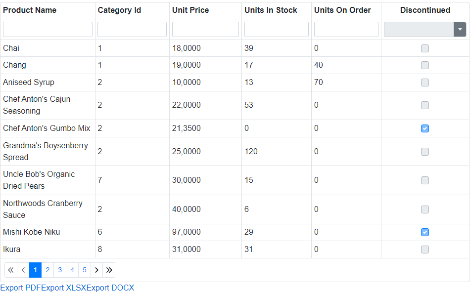
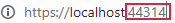

<!-- default badges list -->

<!-- default badges end -->

# Data Grid for Blazor - How to use DevExpress Reporting tools to implement export in a WASM application

This example illustrates how to use DevExpress Reporting tools to export Data Grid's content to different file formats (.pdf/.xlsx/.docx) in a Blazor WebAssembly application.

In this example, the Data Grid uses its [CustomData](https://docs.devexpress.com/Blazor/DevExpress.Blazor.DxDataGrid-1.CustomData) property to [bind to the external Web API service](./CS/DxDataGridExportingWithReportsClientBlazor/DxDataGridExportingWithReportsClientBlazor/Pages/Index.razor#L26). The Web API service source code is in the [DataSourceWebApi folder](./CS/DataSourceWebApi/DataSourceWebApi). The database name is "Northwind". You can find its script generation file in the [DBBackup folder](./CS/DataSourceWebApi/DataSourceWebApi/DBBackup). Generate this data on your SQL server and change the connection string in [NWINDContext.cs file](./CS/DataSourceWebApi/DataSourceWebApi/Models/NWINDContext.cs) (see the OnConfiguring method). 

Your export and Web API applications should have the same port. Start the Web API application and copy the port from the URL:

Paste the port number to the `MyWebApiUrl` [variable](./CS/DxDataGridExportingWithReportsClientBlazor/DxDataGridExportingWithReportsClientBlazor/Pages/Index.razor#L26).

The [ExportButtons](./CS/DxDataGridExportingWithReportsClientBlazor/DxDataGridExportingWithReportsClientBlazor/Components/ExportButtons.razor) component contains export buttons. Each export button contains an URI to a specific [ExportedDocument](./CS/DataSourceWebApi/DataSourceWebApi/Controllers/ProductsController.cs#L34) controller method in the Web API service. This URI contains DataGrid's options. The created report contains only data that is visible in the grid after sort and filter operations.

Use the [ReportHelper.CreateReport](./CS/DxDataGridExportingWithReports/Helpers/ReportHelper.cs#L9) method with the [ExportToPdf(String)](https://docs.devexpress.com/XtraReports/DevExpress.XtraReports.UI.XtraReport.ExportToPdf(System.String-DevExpress.XtraPrinting.PdfExportOptions))/[ExportToXlsx(Stream)](https://docs.devexpress.com/XtraReports/DevExpress.XtraReports.UI.XtraReport.ExportToXls(System.IO.Stream-DevExpress.XtraPrinting.XlsExportOptions))/[ExportToDocx(Stream)](https://docs.devexpress.com/XtraReports/DevExpress.XtraReports.UI.XtraReport.ExportToDocx(System.IO.Stream-DevExpress.XtraPrinting.DocxExportOptions)) methods to create a report that is exported to the file of the corresponding type.

<!-- default file list -->

## Files to Look At

* [Index.razor](./CS/DxDataGridExportingWithReportsClientBlazor/DxDataGridExportingWithReportsClientBlazor/Pages/Index.razor)
* [ExportButtons.razor](./CS/DxDataGridExportingWithReportsClientBlazor/DxDataGridExportingWithReportsClientBlazor/Components/ExportButtons.razor)
* [ProductsController.cs](./CS/DataSourceWebApi/DataSourceWebApi/Controllers/ProductsController.cs)
* [ExportHelper.cs](./CS/DataSourceWebApi/DataSourceWebApi/Services/ExportHelper.cs)
* [NWINDContext.cs](./CS/DataSourceWebApi/DataSourceWebApi/Models/NWINDContext.cs)
* [Products.cs](./CS/DataSourceWebApi/DataSourceWebApi/Models/Products.cs)

<!-- default file list end -->

## Documentation

* [XtraReport](https://docs.devexpress.com/XtraReports/DevExpress.XtraReports.UI.XtraReport)
* [Data Grid: Data Binding](http://docs.devexpress.devx/Blazor/DevExpress.Blazor.DxDataGrid-1.Data)

## More Examples

[DataGrid for Blazor - How to use DevExpress Reporting tools to implement export in a server application](https://github.com/DevExpress-Examples/blazor-server-dxdatagrid-export)

[How to use DevExpress Reporting Components in Blazor applications](https://supportcenter.devexpress.com/ticket/details/t834711/how-to-use-devexpress-reporting-components-in-blazor-applications)

